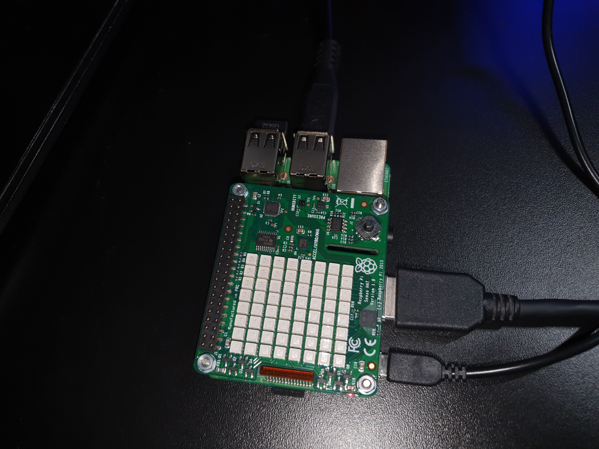
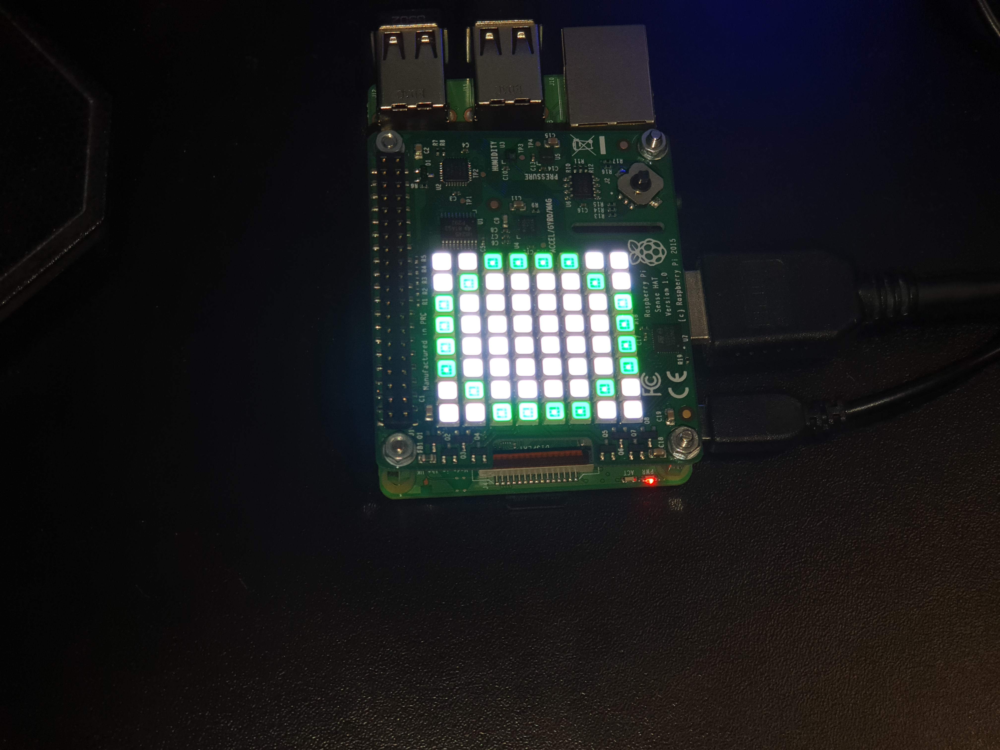
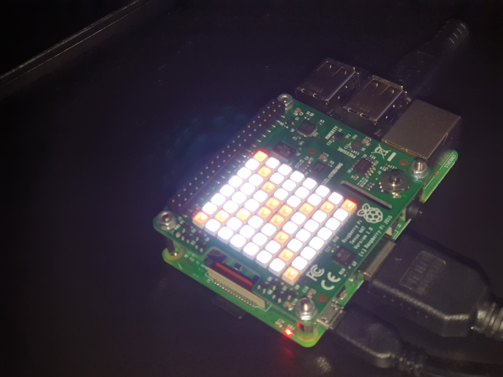

# Sense-Hat
I made a simple Weather Station with a Sense Hat attached to a Raspberry Pi 3 B+.

But what is a Sense Hat?

The Raspberry Pi site states the following ->

> The Sense HAT is an add-on board for Raspberry Pi, made especially for the Astro Pi mission – it launched to the International Space Station in December 2015 – and is now available to buy.

> The Sense HAT has an 8×8 RGB LED matrix, a five-button joystick and includes the following sensors:

> ### Gyroscope
> ### Accelerometer
> ### Magnetometer
> ### Temperature
> ### Barometric pressure
> ### Humidity

For this project I only used the **Temperature**, **Barometric** pressure and **Humidity** sensors.  
Every 10 minutes the current **Temperature in degrees Celcius**, **Barometric pressure in Millibars** and the **percentage of relative Humidity** is uploaded to ThingSpeak. 

When that happens, a green circle is shown on the 8x8 LED's.
When the program terminates a red cross is shown.

Middle clicking on the joystick shows the last measured Temperature on the 8x8 LED's.  
Moving the joystick to the left shows the last measured Humidity.  
Moving the joystick to the right shows the last measured Barometric pressure.

[ThingSpeak](https://thingspeak.com/channels/972879)

### Raspberry Pi 3B+ with the Sense Hat attached to it

### When the temperature, barometric pressure and humidity has been uploaded to ThingSpeak

### Barometric pressure is showing

### When the program is terminated

[Raspberry Pi site regarding the Sense Hat](https://www.raspberrypi.org/products/sense-hat/)
